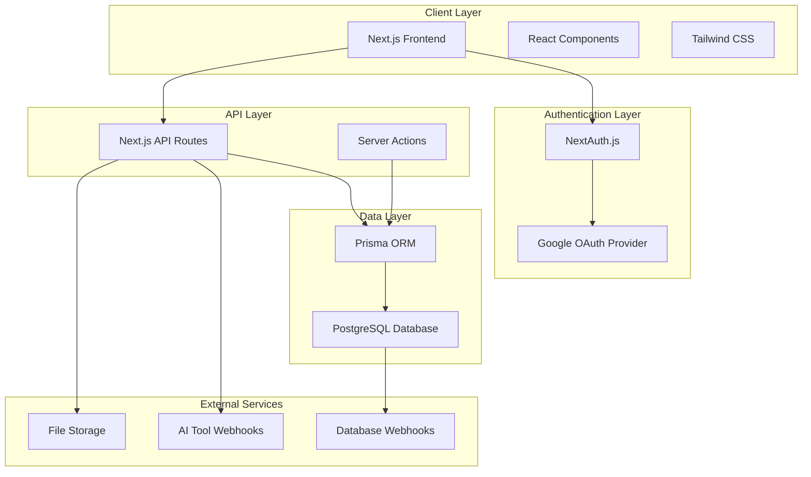

# Design Document

## Overview

This design document outlines the architecture and implementation approach for migrating a React-based AI photo editing application to Next.js with PostgreSQL database and Google Authentication. The application will be built using modern web technologies including Next.js 14 with App Router, NextAuth.js for authentication, Prisma ORM for database management, and Tailwind CSS for styling.

## Architecture

### High-Level Architecture



### Technology Stack

- **Frontend Framework**: Next.js 14 with App Router
- **Authentication**: NextAuth.js with Google OAuth
- **Database**: PostgreSQL with Prisma ORM
- **Styling**: Tailwind CSS with Shadcn/ui components
- **State Management**: React Query (TanStack Query)
- **File Upload**: Next.js built-in file handling
- **Internationalization**: next-intl for bilingual support
- **Icons**: Lucide React
- **Animations**: Framer Motion

## Components and Interfaces

### Core Components Structure

```
src/
├── app/
│   ├── (auth)/
│   │   └── signin/
│   ├── (dashboard)/
│   │   ├── edit-photo/
│   │   ├── gallery/
│   │   ├── cart/
│   │   └── profile/
│   ├── privacy/
│   ├── returns/
│   ├── api/
│   │   ├── auth/
│   │   ├── photos/
│   │   ├── cart/
│   │   └── orders/
│   └── globals.css
├── components/
│   ├── ui/ (Shadcn components)
│   ├── layout/
│   │   ├── Header.tsx
│   │   ├── Footer.tsx
│   │   └── Navigation.tsx
│   ├── auth/
│   │   └── SignInButton.tsx
│   ├── photo/
│   │   ├── PhotoUpload.tsx
│   │   ├── BeforeAfterSlider.tsx
│   │   ├── PhotoEditor.tsx
│   │   └── PhotoGallery.tsx
│   ├── cart/
│   │   ├── CartItem.tsx
│   │   └── CartSummary.tsx
│   └── common/
│       ├── LanguageToggle.tsx
│       └── LoadingSpinner.tsx
├── lib/
│   ├── auth.ts
│   ├── db.ts
│   ├── utils.ts
│   └── validations.ts
├── hooks/
│   ├── useCart.ts
│   ├── usePhotos.ts
│   └── useOrders.ts
├── types/
│   └── index.ts
└── providers/
    ├── AuthProvider.tsx
    ├── QueryProvider.tsx
    └── LanguageProvider.tsx
```

### Authentication Interface

```typescript
// NextAuth.js configuration
interface User {
  id: string;
  email: string;
  name: string;
  image: string;
  createdAt: Date;
  updatedAt: Date;
}

interface Session {
  user: User;
  expires: string;
}
```

### API Route Interfaces

```typescript
// Photo API endpoints
POST /api/photos/upload
POST /api/photos/process
GET /api/photos
PUT /api/photos/[id]
DELETE /api/photos/[id]

// Cart API endpoints
GET /api/cart
POST /api/cart/add
PUT /api/cart/[id]
DELETE /api/cart/[id]

// Order API endpoints
POST /api/orders
GET /api/orders
GET /api/orders/[id]
```

## Data Models

### Database Schema (Prisma)

```prisma
model User {
  id        String   @id @default(cuid())
  email     String   @unique
  name      String?
  image     String?
  createdAt DateTime @default(now())
  updatedAt DateTime @updatedAt
  
  photos    Photo[]
  cartItems CartItem[]
  orders    Order[]
  
  @@map("users")
}

model Photo {
  id              String   @id @default(cuid())
  userId          String
  title           String
  aiTool          String
  originalUrl     String
  editedUrl       String?
  thumbnailUrl    String?
  editingSettings Json
  price           Decimal
  printSize       String
  status          String   @default("processing")
  createdAt       DateTime @default(now())
  updatedAt       DateTime @updatedAt
  
  user      User       @relation(fields: [userId], references: [id], onDelete: Cascade)
  cartItems CartItem[]
  
  @@map("photos")
}

model CartItem {
  id           String  @id @default(cuid())
  userId       String
  photoId      String
  photoTitle   String
  photoUrl     String
  printSize    String
  quantity     Int
  pricePerItem Decimal
  totalPrice   Decimal
  createdAt    DateTime @default(now())
  updatedAt    DateTime @updatedAt
  
  user  User  @relation(fields: [userId], references: [id], onDelete: Cascade)
  photo Photo @relation(fields: [photoId], references: [id], onDelete: Cascade)
  
  @@map("cart_items")
}

model Order {
  id              String   @id @default(cuid())
  userId          String
  orderNumber     String   @unique
  items           Json
  totalAmount     Decimal
  shippingAddress Json
  status          String   @default("pending")
  trackingNumber  String?
  orderDate       DateTime @default(now())
  createdAt       DateTime @default(now())
  updatedAt       DateTime @updatedAt
  
  user User @relation(fields: [userId], references: [id], onDelete: Cascade)
  
  @@map("orders")
}
```

### TypeScript Interfaces

```typescript
interface EditingSettings {
  category: 'visa' | 'absher' | 'saudi-look' | 'baby';
  size: string;
  quantity: number;
  addFrame?: boolean;
  extraPrintSets?: number;
}

interface ShippingAddress {
  fullName: string;
  addressLine1: string;
  addressLine2?: string;
  city: string;
  state: string;
  postalCode: string;
  country: string;
}

interface OrderItem {
  photoTitle: string;
  photoUrl: string;
  printSize: string;
  quantity: number;
  price: number;
}
```

## Error Handling

### Client-Side Error Handling

- **Form Validation**: Use Zod schemas with React Hook Form for client-side validation
- **API Error Handling**: Implement error boundaries and toast notifications
- **Network Errors**: Retry logic with exponential backoff using React Query
- **File Upload Errors**: Progress indicators and error messages for upload failures

### Server-Side Error Handling

```typescript
// API route error handling pattern
export async function POST(request: Request) {
  try {
    // API logic
  } catch (error) {
    if (error instanceof ValidationError) {
      return NextResponse.json({ error: error.message }, { status: 400 });
    }
    if (error instanceof AuthenticationError) {
      return NextResponse.json({ error: 'Unauthorized' }, { status: 401 });
    }
    return NextResponse.json({ error: 'Internal Server Error' }, { status: 500 });
  }
}
```

### AI Webhook Error Handling

- **Timeout Handling**: 60-second timeout for AI processing requests
- **Retry Logic**: Exponential backoff for failed webhook calls
- **Fallback Responses**: Graceful degradation when AI services are unavailable
- **Status Tracking**: Update photo status based on processing results

## Testing Strategy

### Unit Testing
- **Components**: Test React components with React Testing Library
- **API Routes**: Test API endpoints with Jest and Supertest
- **Utilities**: Test helper functions and validation schemas
- **Hooks**: Test custom React hooks with React Hooks Testing Library

### Integration Testing
- **Authentication Flow**: Test Google OAuth integration
- **Database Operations**: Test Prisma queries and mutations
- **File Upload**: Test file upload and storage functionality
- **AI Webhook Integration**: Mock external AI services for testing

### End-to-End Testing
- **User Workflows**: Test complete user journeys with Playwright
- **Cross-browser Testing**: Ensure compatibility across major browsers
- **Mobile Responsiveness**: Test responsive design on various screen sizes
- **Internationalization**: Test language switching and RTL layout

## Performance Considerations

### Frontend Optimization
- **Code Splitting**: Implement route-based code splitting with Next.js
- **Image Optimization**: Use Next.js Image component for optimized loading
- **Lazy Loading**: Implement lazy loading for photo galleries
- **Caching**: Utilize React Query for client-side caching

### Backend Optimization
- **Database Indexing**: Add appropriate indexes for frequently queried fields
- **Connection Pooling**: Configure PostgreSQL connection pooling
- **API Caching**: Implement caching for static content and user data
- **File Storage**: Optimize file storage with CDN integration

### Monitoring and Analytics
- **Performance Monitoring**: Implement Core Web Vitals tracking
- **Error Tracking**: Set up error monitoring with Sentry or similar
- **Database Monitoring**: Monitor query performance and connection health
- **User Analytics**: Track user interactions and conversion metrics

## Security Considerations

### Authentication Security
- **OAuth Security**: Implement proper OAuth flow with PKCE
- **Session Management**: Secure session handling with NextAuth.js
- **CSRF Protection**: Built-in CSRF protection with Next.js
- **Rate Limiting**: Implement rate limiting for API endpoints

### Data Security
- **Input Validation**: Validate all user inputs on both client and server
- **SQL Injection Prevention**: Use Prisma ORM for parameterized queries
- **File Upload Security**: Validate file types and implement virus scanning
- **Data Encryption**: Encrypt sensitive data at rest and in transit

### Privacy Compliance
- **GDPR Compliance**: Implement data deletion and export capabilities
- **Data Minimization**: Collect only necessary user data
- **Consent Management**: Implement proper consent mechanisms
- **Audit Logging**: Log all data access and modifications

## Deployment Architecture

### Production Environment
- **Hosting**: Deploy on Vercel or similar Next.js-optimized platform
- **Database**: PostgreSQL on managed service (AWS RDS, Supabase, or PlanetScale)
- **File Storage**: AWS S3 or Cloudinary for image storage
- **CDN**: CloudFront or Vercel Edge Network for global content delivery

### Environment Configuration
- **Environment Variables**: Secure management of API keys and secrets
- **Database Migrations**: Automated migration deployment with Prisma
- **CI/CD Pipeline**: Automated testing and deployment pipeline
- **Monitoring**: Application performance monitoring and alerting

## Internationalization Implementation

### Language Support
- **Translation Management**: Use next-intl for comprehensive i18n support
- **RTL Layout**: CSS-in-JS solution for dynamic RTL/LTR switching
- **Date/Number Formatting**: Locale-specific formatting for dates and currencies
- **Content Management**: Structured approach to managing translations

### Implementation Details
```typescript
// Language configuration
const locales = ['en', 'ar'] as const;
type Locale = typeof locales[number];

// RTL detection
const isRTL = (locale: string) => locale === 'ar';

// Translation structure
interface Messages {
  navigation: {
    home: string;
    editPhoto: string;
    gallery: string;
    cart: string;
    profile: string;
  };
  // ... other translation keys
}
```

This design provides a comprehensive foundation for migrating the React application to Next.js while maintaining all existing functionality and adding the requested enhancements like Google Authentication and PostgreSQL integration.